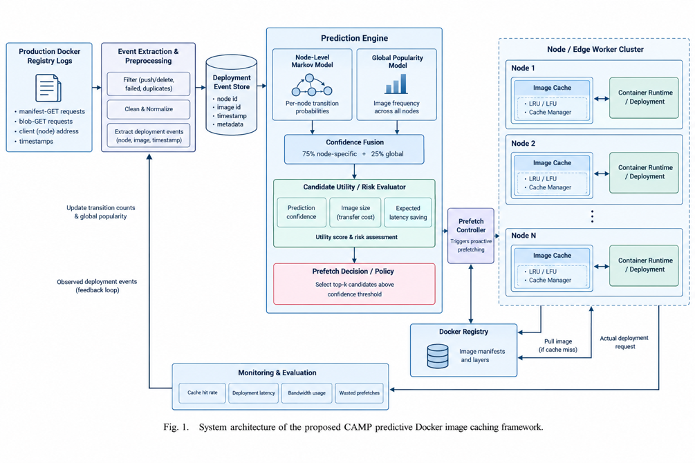

# CAMP: Predictive Docker Image Caching

**Confidence-Aware Markov Prefetching (CAMP)** predicts which container images a node will request next, prefetches the ones worth the bandwidth, and measures the effect on deployment latency. It is evaluated on a real production Docker registry trace, not synthetic data.

> **Status:** research prototype from an Operating Systems course project. A paper is in preparation and has not been published or peer reviewed. Treat the numbers below as results on one sampled subset of one datacenter (see [Limitations](#limitations)).



## Why

When a node has to start a container and the image is not cached locally, it pulls from the registry first, and that pull can dominate startup time. Reactive caches (LRU, LFU) only react after the request. CAMP looks at each node's request history, predicts the next image, and pulls it early, but only when the prediction is confident enough to be worth the bandwidth.

Markov-chain prefetching itself is an old idea (Joseph & Grunwald, 1997). The contribution here is applying it to container-image demand with confidence-aware admission, evaluated end to end on real registry traffic.

## Results

Real trace, datacenter `stage-dal09`, 41-file stride sample, 152,038 deployment events, 1,320 nodes, 3,747 images. Temporal split (train on the earliest events, test on the later unseen ones). Per-node cache capacity 2,000 MB.

**80/20 split** (30,408 test events):

| Strategy | Hit rate | Avg latency (ms) | Data pulled (MB) | False prefetches |
|---|---|---|---|---|
| No prefetch / LRU / LFU | 90.5% | 370.34 | 3,624 | 0 |
| Popularity prefetch | 90.5% | 370.19 | 3,625 | 1,539 |
| **CAMP** | **93.1%** | **305.48** | 4,088 | 604 |

CAMP cuts average latency by 17.5% versus the reactive baselines, pulls about 13% more data, and makes fewer wasted prefetches than the popularity baseline.

**70/30 split** (45,612 test events): baselines 89.1% / 463.65 ms; CAMP 91.3% / 393.21 ms (15.2% lower latency); false prefetches 1,306 (CAMP) vs 1,882 (popularity).

No-prefetch, LRU and LFU are identical because with 2,000 MB per node almost no node ever needs to evict, so the eviction policy never matters. A smaller capacity would separate them; that experiment has not been run.

## How it works

```
registry logs -> clean -> deployment events -> predict -> rank -> prefetch -> cache -> measure
```

1. **Events.** Each manifest GET is a deployment. Image = the two repo hashes in the URI, node = the client address. Blob GETs within 5 s of the manifest, same node and image, are folded in for size and latency.
2. **Cleaning.** Drops non-pull methods, non-2xx responses, duplicate log IDs, unmatched URIs, and duration outliers (IQR). A cleaning report is printed on every run.
3. **Predict** (`src/predictor.py`). Per-node Markov transition counts blended with a recency-decayed global frequency: `score = 0.75 * P(next | last on this node) + 0.25 * global share`.
4. **Rank and admit** (`src/cache_manager.py`). Utility = `prob * pull_time(size) / sqrt(size)`. Only candidates with probability >= `min_confidence` (0.15) are prefetched.
5. **Serve and learn.** Hit or miss is served from the per-node cache, then the model updates online.
6. **Metrics** are counted only in the held-out test window.

## Repository layout

```
.
├── README.md
├── LICENSE
├── requirements.txt
├── data/
│   ├── README.md                    where to get the trace, log format
│   └── sample_stage-dal09.json      7-record excerpt for smoke tests
├── src/
│   ├── real_trace_loader.py         parse + clean raw JSON logs, build deployment events
│   ├── predictor.py                 Markov + frequency demand predictor
│   ├── cache_manager.py             per-node cache, ranking, prefetch, simulation of all 5 strategies
│   ├── run_evaluation_real.py       entry point for the real trace
│   ├── run_evaluation.py            synthetic demo only (pipeline sanity check, not a result)
│   └── trace_generator.py           synthetic trace generator for the demo
├── outputs/                         results produced by the code (see outputs/README.md)
└── docs/architecture.png
```

## Requirements

Python 3. The real-trace pipeline uses only the standard library. `numpy` is needed only for the synthetic demo (`pip install -r requirements.txt`). Smoke-tested on Python 3.12 on Linux; the reported results were produced on the author's Windows machine (Python version not recorded). Other versions have not been tried.

## Quick start

Smoke test (no download needed; too few events for meaningful numbers):

```bash
python src/run_evaluation_real.py data --limit 1 --warmup 0.5
```

### Reproduce the reported results

1. Download the trace from <https://dssl.cs.vt.edu/drtp/> (check its terms) and extract it. It is about 22 GB and is not in this repo.
2. Build the 41-file stride sample (every 5th file by name, which spreads the sample across the whole period).

   PowerShell:
   ```powershell
   $src = "C:\path\to\DockerRegistryTraces\data_centers\stage-dal09"
   $dst = "C:\path\to\DockerRegistryTraces\data_centers\stage-dal09-sample"
   New-Item -ItemType Directory -Force -Path $dst | Out-Null
   $files = Get-ChildItem -Path $src -Filter *.json | Sort-Object Name
   for ($i = 0; $i -lt $files.Count; $i += 5) { Copy-Item $files[$i].FullName -Destination $dst }
   ```

   bash:
   ```bash
   mkdir -p stage-dal09-sample
   ls stage-dal09/*.json | sort | awk 'NR%5==1' | xargs -I{} cp {} stage-dal09-sample/
   ```
3. Run:
   ```bash
   python src/run_evaluation_real.py /path/to/stage-dal09-sample --limit 100 --warmup 0.8 --save-dir outputs
   ```

You should see 152,038 events (121,630 train / 30,408 test) and the CAMP row `93.1% | 305.48 | 4,088 | 604`. The pipeline has no randomness, so repeated runs give identical output. If your numbers differ, check that your sample has exactly 41 files.

### Options

| Flag | Default | Meaning |
|---|---|---|
| `folder` | required | Directory of `*.json` log files |
| `--limit` | 10 | Max number of files to load |
| `--warmup` | 0.7 | Fraction of events (chronological) used to train before evaluation |
| `--max-events` | none | Cap on parsed events |
| `--save-dir` | none | Also save the console output (`.txt`) and a results table (`.csv`) into this folder |

Cache capacity (`CACHE_CAPACITY_MB`, 2000) is set at the top of `run_evaluation_real.py`; the confidence threshold (`min_confidence=0.15`) is the default argument of `rank_candidates` in `src/cache_manager.py`.

### Reading the output

`Hit Rate` and `Avg Latency` are per test event. A hit costs a fixed 5 ms (an assumption); a miss uses the real observed request duration from the trace. `Data Pulled` is MB fetched during the test window, including prefetches. `False Prefetch` counts images prefetched during the test window that were never requested afterwards.

## Outputs

`--save-dir outputs` writes the full console log and a CSV of the results table to `outputs/`, one pair per `--warmup` value. `outputs/results_summary_graph.png` is the summary chart of the 80/20 results. See `outputs/README.md`.

## Limitations

- **Sampled data:** 41 of about 200 files from one datacenter (`stage-dal09`). Other datacenters and the full trace are untested.
- **One cache size** (2,000 MB). No capacity sensitivity analysis yet.
- **One deterministic run per split.** Reproducible, but not a statistical test across independent samples.
- **Baseline predictor only:** Markov plus frequency. No learned model (for example gradient boosting or a sequence model) has been compared.
- **Hit latency is a constant** (5 ms), not measured.
- **Does not scale to the full trace yet.** `src/predictor.py` scans every known image on every event, so the full 200-file run is impractically slow. Use the sample folder.
- Image identity is inferred from anonymized URI hashes, and the "deployment = manifest GET" mapping is an assumption about Docker client behavior.

## Data and references

- A. Anwar et al., "Improving Docker Registry Design based on Production Workload Analysis," USENIX FAST 2018 (source of the trace).
- D. Joseph and D. Grunwald, "Prefetching using Markov Predictors," ACM SIGARCH Computer Architecture News, 1997.
- Z. Huang et al., "Multi-Grained Trace Collection, Analysis, and Management of Diverse Container Images," IEEE Transactions on Computers, 2024.

## License

MIT (see `LICENSE`). The trace data is not covered by this license.

## Author

Navya Jindal, Vellore Institute of Technology.
